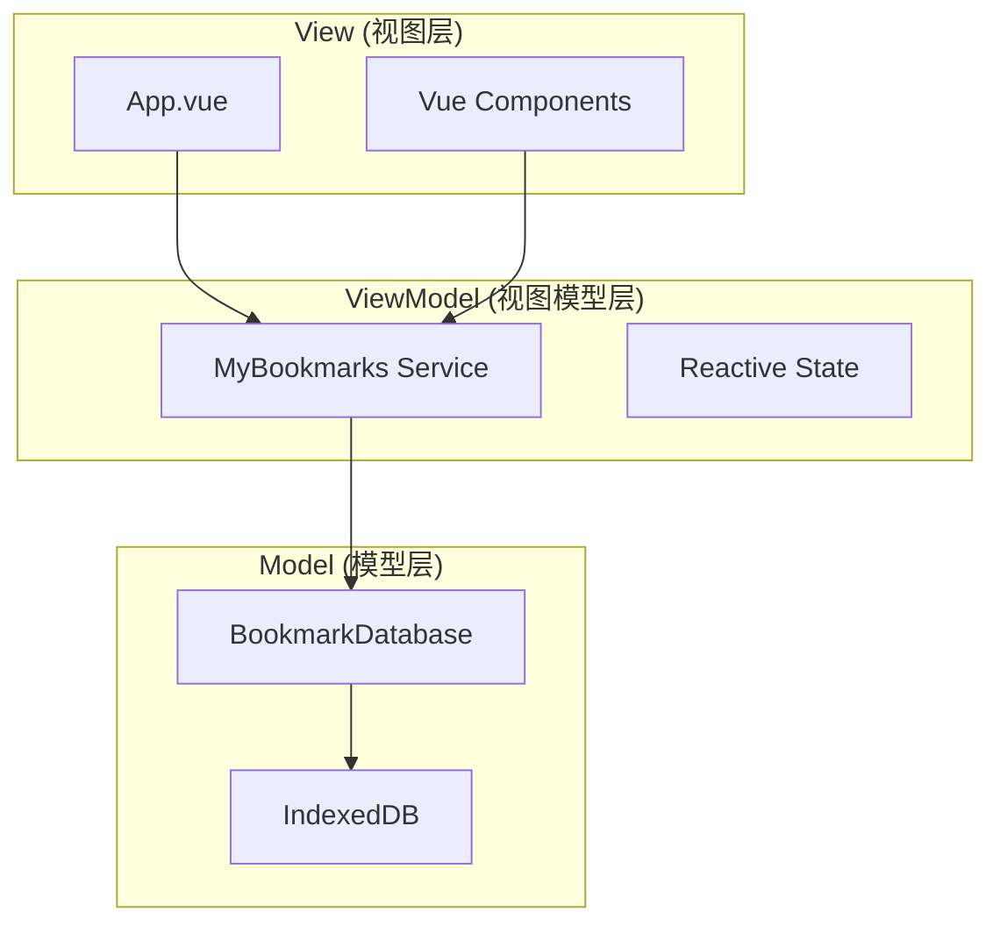

# 开发指南

本文档为稀饭导航项目的开发者提供详细的开发指南，包括项目架构、API 文档、开发流程等。

## 目录

- [项目架构](#项目架构)
- [开发环境设置](#开发环境设置)
- [项目结构](#项目结构)
- [核心模块](#核心模块)
- [API 文档](#api-文档)
- [开发流程](#开发流程)
- [测试指南](#测试指南)
- [调试技巧](#调试技巧)
- [性能优化](#性能优化)
- [常见问题](#常见问题)

## 项目架构

### 技术栈

- **前端框架**: Vue 3.5.19 with Composition API
- **类型系统**: TypeScript 5.9.2
- **构建工具**: Vite 7.1.3
- **UI 组件库**: Element Plus 2.10.7
- **数据存储**: Dexie.js (IndexedDB 封装)
- **样式**: CSS + Element Plus 主题

### 架构模式

nav 采用 **MVVM (Model-View-ViewModel)** 架构模式：



## 开发环境设置

### 系统要求

- **Node.js**: >= 18.0.0
- **npm**: >= 8.0.0
- **浏览器**: 支持现代 ES6+ 语法

### 快速开始

```bash
# 克隆项目
git clone https://github.com/ixiongdi/nav.git
cd xifan-nav

# 安装依赖
npm install

# 启动开发服务器
npm run dev

# 在新终端运行类型检查
npm run type-check
```

### IDE 配置

推荐使用 **Visual Studio Code** 并安装以下扩展：

- Vue Language Features (Volar)
- TypeScript Vue Plugin (Volar)
- Prettier - Code formatter
- ESLint

#### VS Code 设置

```json
// .vscode/settings.json
{
  "editor.formatOnSave": true,
  "editor.defaultFormatter": "esbenp.prettier-vscode",
  "typescript.preferences.importModuleSpecifier": "relative",
  "vue.server.hybridMode": true
}
```

## 项目结构

```
xifan-nav/
├── src/
│   ├── types/           # TypeScript 类型定义
│   │   └── bookmark.ts  # 书签相关类型
│   ├── utils/           # 工具函数
│   │   ├── bookmarks.ts # 书签业务逻辑
│   │   ├── database.ts  # 数据库操作
│   │   └── parser.ts    # HTML 解析器
│   ├── App.vue          # 根组件
│   ├── main.ts          # 应用入口
│   └── vite-env.d.ts    # Vite 类型声明
├── public/              # 静态资源
├── docs/                # 项目文档
├── .github/             # GitHub 配置
│   ├── workflows/       # CI/CD 工作流
│   └── ISSUE_TEMPLATE/  # Issue 模板
├── package.json         # 项目配置
├── vite.config.ts       # Vite 配置
├── tsconfig.json        # TypeScript 配置
└── README.md            # 项目说明
```

## 核心模块

### 1. 数据模型 (`src/types/bookmark.ts`)

```typescript
// 书签节点接口
interface BookmarkNode {
  id: string;           // 唯一标识
  title: string;        // 标题
  url?: string;         // URL (文件夹为空)
  type: 'bookmark' | 'folder';  // 类型
  parentId?: string;    // 父节点ID
  favicon?: string;     // 图标URL
  createdAt: Date;      // 创建时间
  updatedAt: Date;      // 更新时间
}

// 创建书签参数
interface CreateBookmarkParams {
  title: string;
  url?: string;
  type: 'bookmark' | 'folder';
  parentId?: string;
}
```

### 2. 数据库层 (`src/utils/database.ts`)

```typescript
class BookmarkDatabase extends Dexie {
  bookmarks!: Table<BookmarkNode>;

  constructor() {
    super('BookmarkDatabase');
    this.version(1).stores({
      bookmarks: '++id, parentId, type, title, url, createdAt'
    });
  }
}
```

### 3. 业务逻辑层 (`src/utils/bookmarks.ts`)

```typescript
class MyBookmarks {
  // 创建书签或文件夹
  async create(params: CreateBookmarkParams): Promise<BookmarkNode>
  
  // 获取所有书签（树形结构）
  async getTree(): Promise<BookmarkNode[]>
  
  // 获取文件夹树（仅文件夹）
  async getFolderTree(): Promise<BookmarkNode[]>
  
  // 搜索书签
  async search(query: string | object): Promise<BookmarkNode[]>
  
  // 删除书签（递归删除子项）
  async removeTree(id: string): Promise<void>
  
  // 更新书签
  async update(id: string, updates: Partial<BookmarkNode>): Promise<void>
}
```

### 4. HTML 解析器 (`src/utils/parser.ts`)

```typescript
// 解析 HTML 书签文件
function parseHtmlToBookmarks(htmlContent: string): BookmarkNode[]

// 导出为 HTML 格式
function exportBookmarksToHtml(bookmarks: BookmarkNode[]): string
```

## API 文档

### MyBookmarks 类方法

#### `create(params: CreateBookmarkParams): Promise<BookmarkNode>`

创建新的书签或文件夹。

**参数:**
- `params.title`: 标题（必填）
- `params.url`: URL（书签必填，文件夹留空）
- `params.type`: 类型（'bookmark' | 'folder'）
- `params.parentId`: 父文件夹ID（可选）

**返回:** 创建的书签节点

**示例:**
```typescript
const bookmark = await myBookmarks.create({
  title: 'Google',
  url: 'https://google.com',
  type: 'bookmark',
  parentId: 'folder-id'
});
```

#### `getTree(): Promise<BookmarkNode[]>`

获取完整的书签树结构。

**返回:** 书签节点数组（根节点）

#### `search(query: string): Promise<BookmarkNode[]>`

搜索书签。

**参数:**
- `query`: 搜索关键词

**返回:** 匹配的书签数组

## 开发流程

### 1. 功能开发流程

1. **创建分支**
   ```bash
   git checkout -b feature/bookmark-import
   ```

2. **开发功能**
   - 更新类型定义
   - 实现业务逻辑
   - 更新 UI 组件
   - 添加错误处理

3. **测试验证**
   ```bash
   npm run build      # 构建测试
   npm run type-check # 类型检查
   ```

4. **提交代码**
   ```bash
   git add .
   git commit -m "feat(import): add bookmark import functionality"
   ```

5. **创建 PR**
   - 填写 PR 模板
   - 请求代码审查
   - 响应反馈

### 2. Bug 修复流程

1. **重现问题**
   - 确认 bug 存在
   - 记录重现步骤

2. **创建修复分支**
   ```bash
   git checkout -b fix/search-encoding-issue
   ```

3. **实现修复**
   - 定位问题原因
   - 实现最小化修复
   - 添加防护代码

4. **验证修复**
   - 确认问题解决
   - 回归测试

## 测试指南

### 手动测试清单

#### 书签管理
- [ ] 创建书签
- [ ] 创建文件夹
- [ ] 编辑书签/文件夹
- [ ] 删除书签/文件夹
- [ ] 拖拽移动

#### 搜索功能
- [ ] 按标题搜索
- [ ] 按 URL 搜索
- [ ] 空白搜索
- [ ] 特殊字符搜索

#### 导入导出
- [ ] 导入 Chrome 书签
- [ ] 导入 Firefox 书签
- [ ] 导出为 HTML
- [ ] 大文件处理

#### 数据持久化
- [ ] 数据保存
- [ ] 页面刷新后数据恢复
- [ ] 浏览器重启后数据恢复

### 浏览器兼容性测试

- [ ] Chrome (最新版本)
- [ ] Firefox (最新版本)
- [ ] Safari (最新版本)
- [ ] Edge (最新版本)

## 调试技巧

### 1. 开发工具

```typescript
// 在浏览器控制台中访问数据库
const db = new BookmarkDatabase();
const allBookmarks = await db.bookmarks.toArray();
console.log(allBookmarks);
```

### 2. 常用调试命令

```bash
# 查看构建详情
npm run build -- --debug

# 查看依赖分析
npm ls

# 清理并重新安装
rm -rf node_modules package-lock.json
npm install
```

### 3. Vue Devtools

安装 Vue Devtools 浏览器扩展，可以：
- 查看组件状态
- 监听事件
- 检查响应式数据
- 性能分析

## 性能优化

### 1. 数据库查询优化

```typescript
// ✅ 好的做法：使用索引
await db.bookmarks.where('parentId').equals(folderId).toArray();

// ❌ 避免：全表扫描
await db.bookmarks.filter(item => item.parentId === folderId).toArray();
```

### 2. 组件优化

```vue
<script setup lang="ts">
// ✅ 使用 computed 缓存计算结果
const filteredBookmarks = computed(() => {
  return bookmarks.value.filter(b => b.title.includes(searchQuery.value));
});

// ✅ 使用 v-memo 优化列表渲染
</script>

<template>
  <div v-for="bookmark in filteredBookmarks" 
       :key="bookmark.id"
       v-memo="[bookmark.title, bookmark.url]">
    <!-- 书签内容 -->
  </div>
</template>
```

### 3. 构建优化

```typescript
// vite.config.ts
export default defineConfig({
  build: {
    rollupOptions: {
      output: {
        manualChunks: {
          vendor: ['vue', 'dexie'],
          ui: ['element-plus']
        }
      }
    }
  }
});
```

## 常见问题

### Q: 如何添加新的书签字段？

1. 更新 `BookmarkNode` 接口
2. 更新数据库 schema
3. 更新创建/更新逻辑
4. 更新 UI 组件

### Q: 如何处理数据库迁移？

```typescript
// database.ts
class BookmarkDatabase extends Dexie {
  constructor() {
    super('BookmarkDatabase');
    
    // 版本 1
    this.version(1).stores({
      bookmarks: '++id, parentId, type, title, url'
    });
    
    // 版本 2 - 添加新字段
    this.version(2).stores({
      bookmarks: '++id, parentId, type, title, url, tags'
    }).upgrade(tx => {
      // 数据迁移逻辑
      return tx.bookmarks.toCollection().modify(bookmark => {
        bookmark.tags = [];
      });
    });
  }
}
```

### Q: 如何调试 IndexedDB 问题？

1. 打开浏览器开发者工具
2. 转到 Application/Storage 标签
3. 查看 IndexedDB → BookmarkDatabase
4. 检查数据结构和内容

### Q: 如何处理大量书签的性能问题？

1. 使用虚拟滚动
2. 实现分页加载
3. 优化搜索算法
4. 添加加载状态

---

更多开发问题请参考 [FAQ.md](FAQ.md) 或在 [GitHub Discussions](https://github.com/ixiongdi/nav/discussions) 中提问。